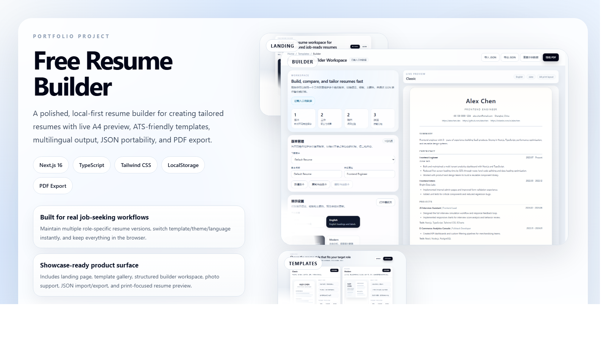
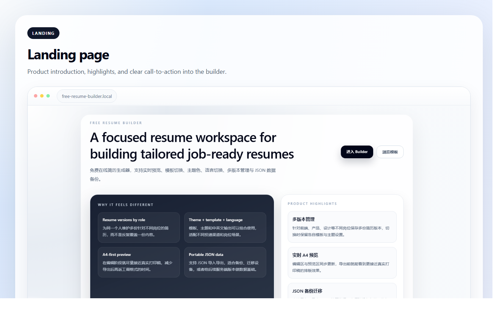
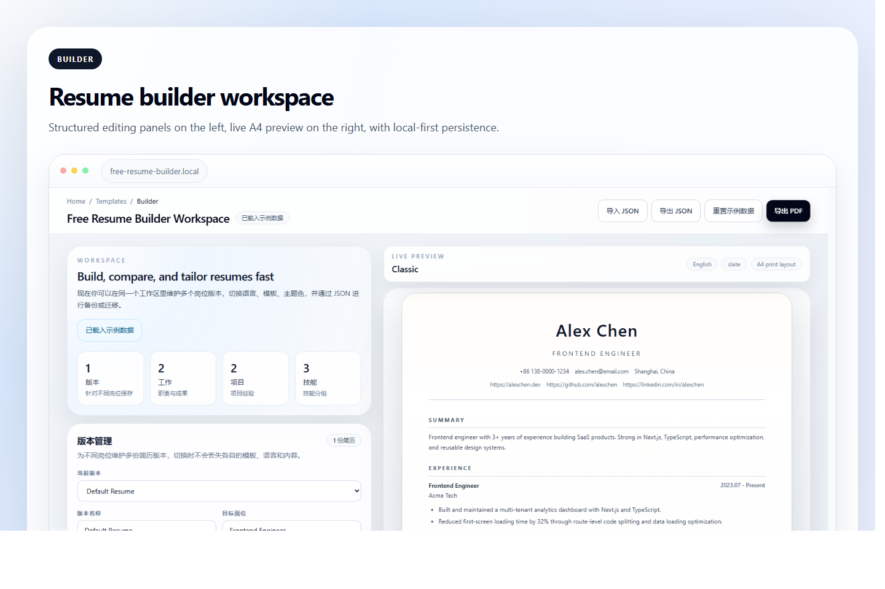
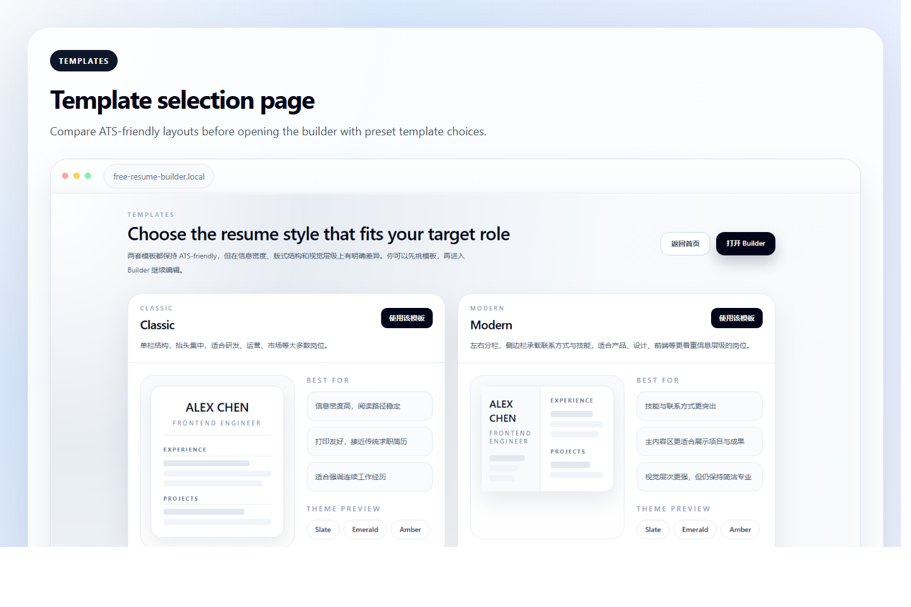
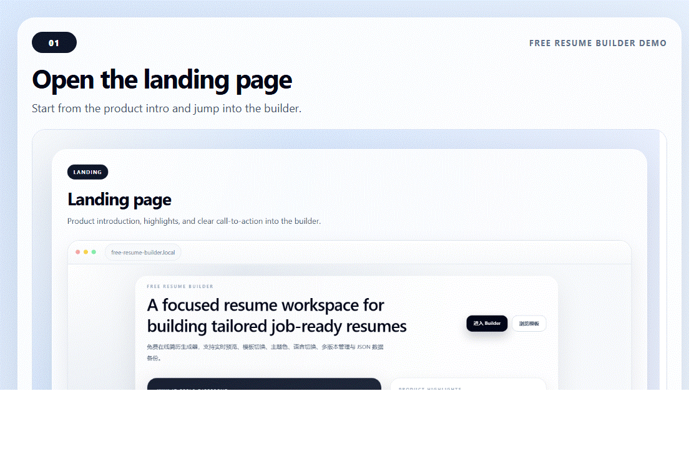
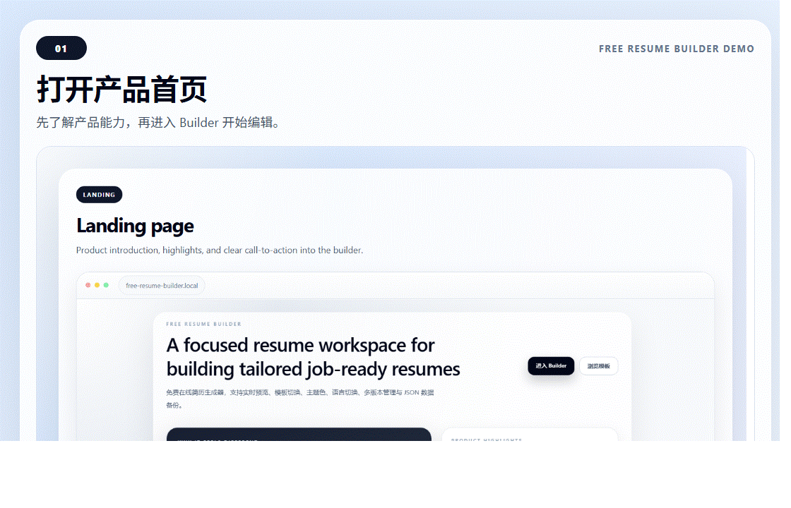

# Free Resume Builder


[中文说明](#中文说明) | [English](#english)



## Highlights

- Local-first online resume builder with live A4 preview, ATS-friendly templates, PDF export, JSON import/export, and multi-version resume management.
- 面向真实求职场景，支持中英文切换、主题色切换、模板切换、照片上传、岗位版本管理和浏览器本地持久化。
- Built with `Next.js 16 + TypeScript + Tailwind CSS`, organized with reusable components and print-focused layout logic.
- 既可以作为可用产品继续扩展，也适合作为前端作品集项目展示。

## Project Gallery

### Screenshots

**Landing Page**



**Builder Workspace**



**Template Selection**



### Demo GIFs

**English Demo**



**中文演示**



## 中文说明

### 项目简介

Free Resume Builder 是一个免费的在线简历生成器，目标是让用户无需购买模板，也能快速制作一份排版专业、适合打印和投递的简历。

当前项目支持：

- 基本信息、教育经历、工作经历、项目经历、技能模块编辑
- 中英文简历切换
- 多版本简历管理，适配不同岗位投递
- 两套 ATS-friendly 模板切换
- 三套主题色切换
- 实时 A4 风格预览
- 个人照片上传、替换、删除与本地保存
- JSON 导入 / 导出
- `localStorage` 自动保存
- 浏览器原生打印导出 PDF

### 项目亮点区

- **更像正式产品**：包含首页、模板页、Builder 工作区、版本管理、展示设置和实时预览。
- **作品集价值更高**：不只是表单页面，而是完整的用户流程和多页面产品结构。
- **前端实现完整**：核心能力全部可在浏览器端使用，无需依赖复杂后端服务。
- **部署灵活**：既适合直接上 Vercel，也支持静态导出后部署到 GitHub Pages。

### 技术栈

- Next.js 16（App Router）
- TypeScript
- Tailwind CSS v4
- localStorage
- Docker / Docker Compose

### 项目结构

```text
src/
  app/
    page.tsx
    builder/page.tsx
    templates/page.tsx
  components/
    builder/
    editor/
    layout/
    preview/
  data/
  hooks/
  lib/
  types/
docs/
  assets/
```

### 本地运行

首次初始化依赖：

```bash
docker compose run --rm deps
```

启动开发环境：

```bash
docker compose up -d web
```

访问地址：

```text
http://localhost:3000
```

停止服务：

```bash
docker compose down
```

如果本机已安装 Node.js 20+，也可以直接运行：

```bash
npm install
npm run dev
```

### PDF 导出说明

项目使用浏览器原生 `window.print()` 导出 PDF。

原因：

- 更适合文本密集型简历
- 对打印样式和分页控制更稳定
- 不需要额外引入重量级截图依赖
- 对照片、主题色和简历版式的保真度更高

### 部署说明

#### Vercel

1. 将仓库导入 Vercel。
2. Framework Preset 选择 `Next.js`。
3. 不要手动把 `NODE_ENV` 设为 `development`。
4. 保持默认构建命令 `npm run build` 即可。

这个项目当前已经验证过在生产环境下可正常执行：

```bash
unset NODE_ENV && npm run build
```

#### GitHub Pages

项目已经支持静态导出模式。部署 GitHub Pages 时，需要启用静态导出并设置仓库路径前缀。

如果你的仓库地址是：

```text
https://github.com/yeliheng-010/free--resume
```

那么推荐的构建方式是：

```bash
STATIC_EXPORT=true NEXT_PUBLIC_BASE_PATH=/free--resume npm run build
```

构建完成后，将 `out/` 目录发布到 GitHub Pages 即可。

建议在 GitHub Actions 中设置：

- `STATIC_EXPORT=true`
- `NEXT_PUBLIC_BASE_PATH=/${{ github.event.repository.name }}`

如果你使用的是仓库级 Pages，而不是自定义域名，这样可以保证静态资源和路由前缀正确。

## English

### Overview

Free Resume Builder is a free online resume generator designed for practical job-seeking workflows. It lets users create polished resumes without purchasing templates, while keeping the experience local-first and easy to iterate on.

Current capabilities include:

- Editing basics, education, experience, projects, and skills
- Chinese / English resume switching
- Multiple resume versions for different target roles
- Two ATS-friendly templates
- Three theme presets
- Real-time A4-style preview
- Profile photo upload with persistence
- JSON import / export
- Browser `localStorage` auto-save
- One-click PDF export via native print

### Why It Works Well as a Portfolio Project

- **Product-like structure**: landing page, template gallery, full builder workspace, and preview flow.
- **Real usability**: not just a mock interface, but an actually usable browser-based resume tool.
- **Good frontend depth**: local state management, persistence, print styling, template systems, and file handling.
- **Deployment-ready**: works well on Vercel and can also be exported for GitHub Pages.

### Tech Stack

- Next.js 16 (App Router)
- TypeScript
- Tailwind CSS v4
- localStorage
- Docker / Docker Compose

### Local Development

Initialize dependencies the first time:

```bash
docker compose run --rm deps
```

Start the dev server:

```bash
docker compose up -d web
```

Open:

```text
http://localhost:3000
```

Stop services:

```bash
docker compose down
```

If Node.js 20+ is available locally:

```bash
npm install
npm run dev
```

### PDF Export Notes

The project uses native browser `window.print()` for PDF export because it is more reliable for text-heavy resumes, preserves print layout better than canvas-based approaches in most browsers, and works well with profile photos and theme styling.

### Deployment

#### Vercel

1. Import the repository into Vercel.
2. Use the default `Next.js` preset.
3. Do not force `NODE_ENV=development`.
4. Keep the default build command: `npm run build`.

#### GitHub Pages

Static export is supported for GitHub Pages.

Build with:

```bash
STATIC_EXPORT=true NEXT_PUBLIC_BASE_PATH=/free--resume npm run build
```

Then publish the generated `out/` directory to GitHub Pages.

Recommended environment variables for GitHub Actions:

- `STATIC_EXPORT=true`
- `NEXT_PUBLIC_BASE_PATH=/${{ github.event.repository.name }}`
